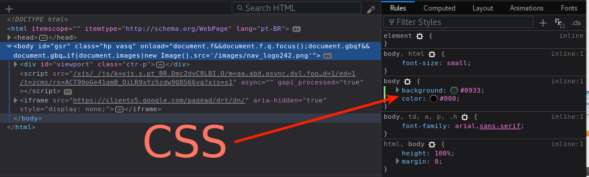
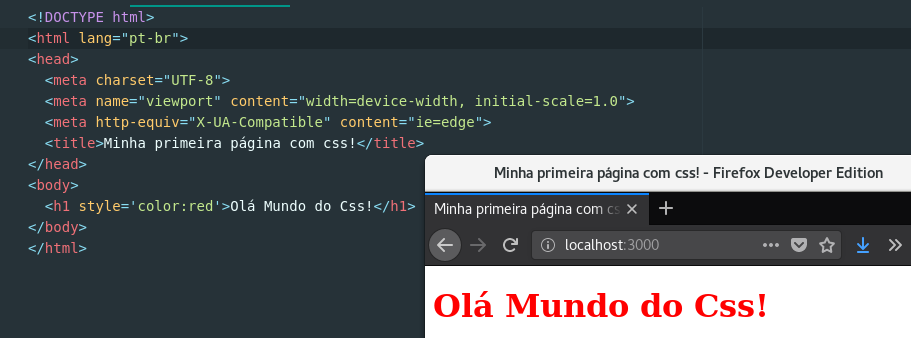

# Curso Frontend Web CSS
> Autor: Felipe Cabral
> Criação: 2018

## Aulas

### Curso Frontend Web CSS #1 - Introdução

* Sobre o instrutor
* Sobre o curso: tópicos aborados, público alvo, etc.
* O que eu preciso saber?
  * HTML
* Como eu me preparo?
  * preset: gnu/linux os + firefox / chrome + atom

#### Referências:
* https://www.debian.org
* https://www.mozilla.org
* https://atom.io
* https://www.mozilla.org/pt-BR/firefox/developer
* https://developer.chrome.com/devtools

### Curso Frontend Web CSS #2 - O que é o que é?

* O que é CSS?
* Por que usar CSS?
* Como fazer na prática?

#### Referências:
* https://www.w3.org/Style/CSS
* https://www.w3.org/standards/webdesign/htmlcss
* Bert Bos, co-inventor of CSS https://www.youtube.com/watch?v=RXDm5u1oo-g
* https://en.wikipedia.org/wiki/Håkon_Wium_Lie
* https://en.wikipedia.org/wiki/Bert_Bos

### Curso Frontend Web CSS #3 - Olá Mundo do CSS!

* Como escrever CSS? "olá mundo do css!"
* CSS inline

#### Referências:
* https://developer.mozilla.org/pt-BR/docs/Web/CSS
* https://developer.mozilla.org/pt-BR/docs/Web/CSS/CSS_Reference
* https://developer.mozilla.org/pt-BR/docs/Web/CSS/sintaxe

### Curso Frontend Web CSS #3 - Sintaxe, Classes e Ids

* Linkando html com css externo
* Como usar classes CSS?
* Como usar ids CSS?

#### Referências:
* https://developer.mozilla.org/pt-BR/docs/Web/CSS
* https://developer.mozilla.org/pt-BR/docs/Web/CSS/CSS_Reference
* https://developer.mozilla.org/pt-BR/docs/Web/CSS/sintaxe

### Curso Frontend Web CSS #4 - Tipos de Seletores

* Seletores 
  * seletor universal
  * seletor de tipos
  * seletor de classes
  * seletor de ID
  * seletor de atributos

#### Referências:
* https://webplatform.github.io
* https://developer.mozilla.org/en-US/docs/Web/CSS/CSS_Selectors
* https://internetingishard.com/html-and-css/css-selectors/

### Curso Frontend Web CSS #5 - Seletores Combinados
*

#### Referências:

### Curso Frontend Web CSS #5 - Pseudo Classes

#### Referências:

### Curso Frontend Web CSS #6 - Projetos

#### Referências:
* http://www.csszengarden.com

### Curso Frontend Web CSS #7 -

#### Referências:

### Curso Frontend Web CSS #8 -

#### Referências:

### Curso Frontend Web CSS #9 -
