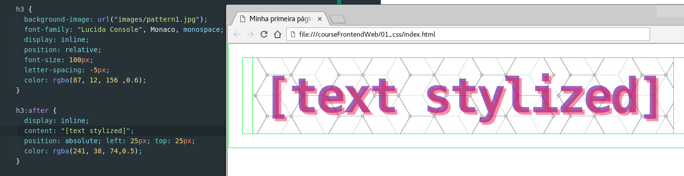

# Curso Frontend Web CSS
> Autor: Felipe Cabral
> Criação: 2018

## Aulas

### Curso Frontend Web CSS #001 - Introdução

* Sobre o instrutor
* Sobre o curso: tópicos aborados, público alvo, etc.
* O que eu preciso saber?
  * HTML
* Como eu me preparo?
  * preset: gnu/linux os + firefox / chrome + atom

#### Referências:
* https://www.debian.org
* https://www.mozilla.org
* https://atom.io
* https://www.mozilla.org/pt-BR/firefox/developer
* https://developer.chrome.com/devtools

----
### Curso Frontend Web CSS #002 - O que é o que é?

* O que é CSS?
* Por que usar CSS?
* Como fazer na prática?

#### Referências:
* https://www.w3.org/Style/CSS
* https://www.w3.org/standards/webdesign/htmlcss
* Bert Bos, co-inventor of CSS https://www.youtube.com/watch?v=RXDm5u1oo-g
* https://en.wikipedia.org/wiki/Håkon_Wium_Lie
* https://en.wikipedia.org/wiki/Bert_Bos

----
### Curso Frontend Web CSS #003 - Olá Mundo do CSS!

* Como escrever CSS? "olá mundo do css!"
* CSS inline

#### Referências:
* https://developer.mozilla.org/pt-BR/docs/Web/CSS
* https://developer.mozilla.org/pt-BR/docs/Web/CSS/CSS_Reference
* https://developer.mozilla.org/pt-BR/docs/Web/CSS/sintaxe

----
### Curso Frontend Web CSS #004 - Sintaxe, Classes e Ids

* Seletores
* Linkando html com css externo
* Como usar classes CSS?
* Como usar ids CSS?

#### Referências:
* https://developer.mozilla.org/pt-BR/docs/Web/CSS
* https://developer.mozilla.org/pt-BR/docs/Web/CSS/CSS_Reference
* https://developer.mozilla.org/pt-BR/docs/Web/CSS/sintaxe

----
### Curso Frontend Web CSS #005 - Tipos de Seletores

* Seletores
  * seletor universal
  * seletor de tipos
  * seletor de classes
  * seletor de ID
  * seletor de atributos

#### Referências:
* https://webplatform.github.io
* https://developer.mozilla.org/en-US/docs/Web/CSS/CSS_Selectors
* https://internetingishard.com/html-and-css/css-selectors/
* https://developer.mozilla.org/en-US/docs/Web/CSS/Class_selectors

----
### Curso Frontend Web CSS #006 - Seletores Simples vs Combinados

* Seletores
  * descendant selector (space)
  * child selector (>)
  * adjacent sibling selector (+)
  * general sibling selector (~)

#### Referências:
https://developer.mozilla.org/en-US/docs/Learn/CSS/Introduction_to_CSS/Simple_selectors
https://www.w3schools.com/css/css_combinators.asp
https://www.wikitechy.com/css/css-selectors

----
### Curso Frontend Web CSS #007 - Estilizando texto I - Fundamentos

* Elementos
  * `<h1>-<h6>` headings
  * `
` paragraphs
  * `` Spans
  * `<em>`
* Propriedades
  * `color`: define a cor do texto

#### Referências:
* https://developer.mozilla.org/en-US/docs/Learn/CSS/Styling_text/Fundamentals
* https://developer.mozilla.org/en-US/docs/Web/CSS/color
* https://developer.mozilla.org/en-US/docs/Web/CSS/CSS_Color

----
### Curso Frontend Web CSS #008 - Estilizando texto II
* Propriedades
  * `font-family`: define uma ou mais fontes usadas em um texto;
    * Web Safe Fonts;
    * `@font-face`: bloco de chamada e definição de uma familia de fontes;
  * `font-size`: define o tamanho do texto;
* Unidades e valores de medidas;

#### Referências:
* https://developer.mozilla.org/en-US/docs/Web/CSS/font-family
  * https://developer.mozilla.org/en-US/docs/Learn/CSS/Styling_text/Web_fonts
  * https://www.w3schools.com/cssref/css_websafe_fonts.asp
* https://developer.mozilla.org/en-US/docs/Web/CSS/font-size
* https://developer.mozilla.org/en-US/docs/Learn/CSS/Introduction_to_CSS/Values_and_units

----
### Curso Frontend Web CSS #009 - Estilizando texto III
* Propriedades
  * `font-style`: define a condição itálico de um texto;
  * `font-weight`:  define o quanto destacado em negrito um determinado texto deve ser;

#### Referências:
* https://developer.mozilla.org/en-US/docs/Web/CSS/font-style
* https://developer.mozilla.org/en-US/docs/Web/CSS/font-weight

----
### Curso Frontend Web CSS #010 - Estilizando texto IV
* Propriedades
  * `text-transform`: define parametros de capitalização de um texto;
  * `text-decoration`: define a edição de sublinhamento de um texto;
    * `text-decoration-line`: uma especificação de `text-decoration` que define o tipo de sublinhado de um determinado texto;
    * `text-decoration-color`: uma especificação de `text-decoration` que define a cor de um elemento sublinhado aplicado a um texto;
    * `text-decoration-style`:  uma especificação de `text-decoration` que define o estilo do sublinhado aplicado a um texto;

#### Referências:
* https://developer.mozilla.org/en-US/docs/Web/CSS/text-transform
* https://developer.mozilla.org/en-US/docs/Web/CSS/text-decoration
* https://developer.mozilla.org/en-US/docs/Web/CSS/text-decoration-line
* https://developer.mozilla.org/en-US/docs/Web/CSS/text-decoration-color
* https://developer.mozilla.org/en-US/docs/Web/CSS/text-decoration-style

----
### Curso Frontend Web CSS #011 - Estilizando texto V
* Propriedades
  * `text-shadow`: define a(s) sobra(s) de um texto;
  * `text-align`: define o alinhamento horizontal do texto;
  * `line-height`: define a altura entre linhas de um texto;

#### Referências:
* https://developer.mozilla.org/en-US/docs/Web/CSS/text-shadow
* https://developer.mozilla.org/en-US/docs/Web/CSS/text-align
* https://developer.mozilla.org/en-US/docs/Web/CSS/line-height

----
### Curso Frontend Web CSS #012 - Estilizando texto VI
* Propriedades
  * `font-variant`: atalho condensador das propriedades font-variant. Definem a apresentação da letra inicial do período, a formatação de posição(sobrescrito/subescrito), font alternativa, entre outros efeitos no texto;
    * `font-variant-alternates`: define o uso de glifos alternativos (adornos, etc) no texto;
    * `font-variant-caps`: define a formatação dos glifos da letra inicial frente ao restante do texto;
    * `font-variant-east-asian`: define glifos alternativos para formas de escrita de línguas do leste asiático como Mandarin e Japones;
    * `font-variant-ligatures`: define a combinação de dois ou mais caracteres de maneira 'ligada';
    * `font-variant-numeric`: define o uso de glifos alternativos para números, frações e marcadores de números ordinais;
    * `font-variant-position`: define o posicionamento sub-escrito ou sobre-escrito de um texto com relação a uma base normal fixa;

#### Referências:
* https://developer.mozilla.org/en-US/docs/Web/CSS/font-variant
* https://developer.mozilla.org/en-US/docs/Web/CSS/font-variant-alternates
* https://developer.mozilla.org/en-US/docs/Web/CSS/font-variant-caps
* https://developer.mozilla.org/en-US/docs/Web/CSS/font-variant-east-asian
  * https://drafts.csswg.org/css-fonts-3/#font-variant-east-asian-prop
  * http://www.antennahouse.com/antenna1/wp-content/uploads/2018/02/axf-font-variant-east-asian-1.pdf
  * http://br.maisfontes.com/hiragino-mincho-pro-w6
* https://developer.mozilla.org/en-US/docs/Web/CSS/font-variant-ligatures
  * https://www.quackit.com/css/css3/properties/css_font-variant-ligatures.cfm
  * https://fonts.google.com/specimen/Lora?selection.family=Lora
* https://developer.mozilla.org/en-US/docs/Web/CSS/font-variant-numeric
* https://css-tricks.com/almanac/properties/f/font-variant-numeric/

----
### Curso Frontend Web CSS #013 - Estilizando texto VII
* Propriedades
  * `font-size-adjust`: ;
  * `font-stretch`:  ;
  * `text-underline-position`:  ;
  * `text-rendering`: ;

#### Referências:
*
*

----
### Curso Frontend Web CSS #014 - Estilizando texto VIII
* Propriedades
  * `text-indent`: define a identação da primeira linha de um bloco de texto;
  * `text-overflow`: define o modo de exibição de um conteúdo contido em um espaço menor do que o tamanho total do texto;
  * `white-space`: define como espaços em branco entre elementos de texto serão tratados;

#### Referências:
*
*

----
### Curso Frontend Web CSS #015 - Estilizando texto IX
* Propriedades
  * `word-break`: define como o navegador deve se comportar em uma situação onde o texto de uma palavra excede o onde está contido. Literalmente a definição de 'quebra de palavra';
  * `direction`: define a direção do texto;
  * `unicode-bidi`: define, junto com a propriedade `direction`	como um determinado texto é apresentado;
  * `hyphens`: define o suporte a hifenização de um texto;

#### Referências:
*
*

----
### Curso Frontend Web CSS #016 - Estilizando texto X
* Propriedades
  * `line-break`: ;
  * `letter-spacing`:	aumenta ou diminui o espaço entre os caracteres de um texto;
  * `text-align-last`: define o alinhamento da última linha de um bloco de texto;
  * `text-orientation`:

#### Referências:
*
*

----
### Curso Frontend Web CSS #017 - Estilizando texto XI
* Propriedades
  * `vertical-align`: define o alinhamento vertical de um texto;
  * `word-wrap`: ;
  * `writing-mode`: ;
  * `word-spacing`: aumenta ou diminui os espaços entre palavras em um texto;

#### Referências:
*
*

----
### Curso Frontend Web CSS #018 - Estilizando texto XII
* Propriedades
  * ``: ;

#### Referências:
*
*

* `background-color`: define a cor de fundo do texto;

----
### Curso Frontend Web CSS #10 - Estilizando Listas I
* Elementos
  * `<ul>` define uma lista não ordenada (unordered list)
  * `<ol>` define uma lista ordenada (ordered list)
  * `<li>` define o item de uma lista (list item)

* Propriedades
  * list-style
    * list-style-type
    * list-style-position
    * list-style-image

#### Referências:
* W3 School
  * https://www.w3schools.com/tags/tag_ul.asp
  * https://www.w3schools.com/tags/tag_ol.asp
  * https://www.w3schools.com/tags/tag_li.asp
  * https://www.w3schools.com/css/css_list.asp
* Mozilla Developers Network (MDN)
  * https://developer.mozilla.org/en-US/docs/Web/HTML/Element/ul
  * https://developer.mozilla.org/en-US/docs/Web/HTML/Element/ol
  * https://developer.mozilla.org/en-US/docs/Web/HTML/Element/li
  * https://developer.mozilla.org/en-US/docs/Learn/CSS/Styling_text/Styling_lists

----
### Curso Frontend Web CSS #10 - Estilizando Listas II
* Elementos
  * `<dl>` define lista descritiva (description list)
  * `<dt>` define um termo em uma lista descritiva (description list term)
  * `<dd>` define a descrição de um termo de uma lista descritiva (description of description list term)

* Propriedades
  * background
  * display
  * margin
  * padding

#### Referências:
* W3 School
  * https://www.w3schools.com/tags/tag_dl.asp
  * https://www.w3schools.com/tags/tag_dt.asp
  * https://www.w3schools.com/tags/tag_dd.asp
  * https://www.w3schools.com/css/css_list.asp
* Mozilla Developers Network (MDN)
  * https://developer.mozilla.org/en-US/docs/Web/HTML/Element/dl
  * https://developer.mozilla.org/en-US/docs/Web/HTML/Element/dt
  * https://developer.mozilla.org/en-US/docs/Web/HTML/Element/dd
  * https://developer.mozilla.org/en-US/docs/Learn/CSS/Styling_text/Styling_lists

----
### Curso Frontend Web CSS #11 -

#### Referências:
* Unidades de medida: https://www.w3.org/Style/Examples/007/units.pt_BR.html
http://desenvolvimentoparaweb.com/css/unidades-css-rem-vh-vw-vmin-vmax-ex-ch/

### Curso Frontend Web CSS #11 - Pseudo Classes

#### Referências:

### Curso Frontend Web CSS #12 - Projetos e frameworks

#### Referências:
http://www.csszengarden.com

#### Referências:
https://developer.mozilla.org/en-US/docs/Learn/Common_questions/What_are_browser_developer_tools

Typografia
https://en.wikipedia.org/wiki/Em_(typography)

Font:
https://developer.mozilla.org/en-US/docs/Web/CSS/font

Css Tricks
https://css-tricks.com/

Canais de aprendizado:
https://webdesign.tutsplus.com/series/learn-css-the-complete-guide--cms-1065
