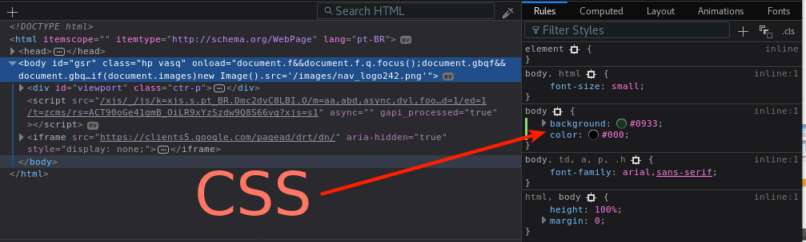
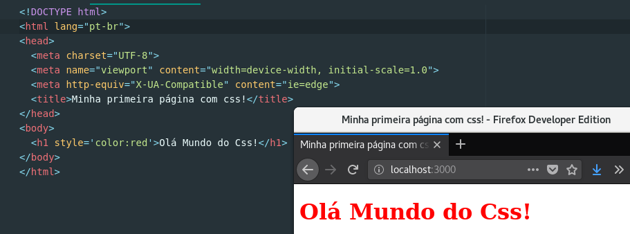
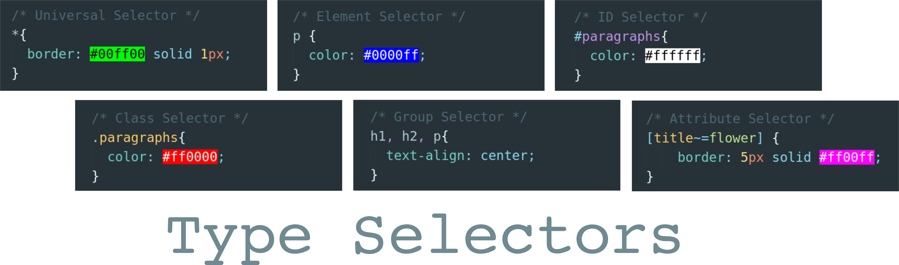
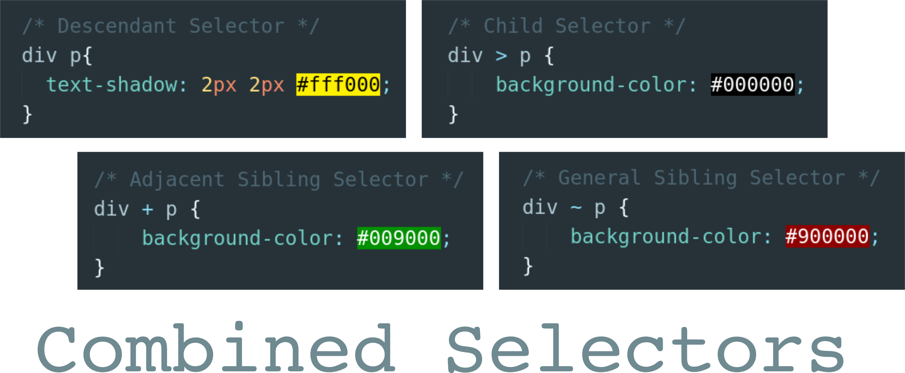

# Curso Frontend Web CSS
> Autor: Felipe Cabral
> Criação: 2018

## Aulas

### Curso Frontend Web CSS #1 - Introdução

* Sobre o instrutor
* Sobre o curso: tópicos aborados, público alvo, etc.
* O que eu preciso saber?
  * HTML
* Como eu me preparo?
  * preset: gnu/linux os + firefox / chrome + atom

#### Referências:
* https://www.debian.org
* https://www.mozilla.org
* https://atom.io
* https://www.mozilla.org/pt-BR/firefox/developer
* https://developer.chrome.com/devtools

----
### Curso Frontend Web CSS #2 - O que é o que é?

* O que é CSS?
* Por que usar CSS?
* Como fazer na prática?

#### Referências:
* https://www.w3.org/Style/CSS
* https://www.w3.org/standards/webdesign/htmlcss
* Bert Bos, co-inventor of CSS https://www.youtube.com/watch?v=RXDm5u1oo-g
* https://en.wikipedia.org/wiki/Håkon_Wium_Lie
* https://en.wikipedia.org/wiki/Bert_Bos

----
### Curso Frontend Web CSS #3 - Olá Mundo do CSS!

* Como escrever CSS? "olá mundo do css!"
* CSS inline

#### Referências:
* https://developer.mozilla.org/pt-BR/docs/Web/CSS
* https://developer.mozilla.org/pt-BR/docs/Web/CSS/CSS_Reference
* https://developer.mozilla.org/pt-BR/docs/Web/CSS/sintaxe

----
### Curso Frontend Web CSS #4 - Sintaxe, Classes e Ids
* Seletores 
* Linkando html com css externo
* Como usar classes CSS?
* Como usar ids CSS?

#### Referências:
* https://developer.mozilla.org/pt-BR/docs/Web/CSS
* https://developer.mozilla.org/pt-BR/docs/Web/CSS/CSS_Reference
* https://developer.mozilla.org/pt-BR/docs/Web/CSS/sintaxe

----
### Curso Frontend Web CSS #5 - Tipos de Seletores
* Seletores 
  * seletor universal
  * seletor de tipos
  * seletor de classes
  * seletor de ID
  * seletor de atributos

#### Referências:
* https://webplatform.github.io
* https://developer.mozilla.org/en-US/docs/Web/CSS/CSS_Selectors
* https://internetingishard.com/html-and-css/css-selectors/
* https://developer.mozilla.org/en-US/docs/Web/CSS/Class_selectors

----
### Curso Frontend Web CSS #6 - Seletores Simples vs Combinados
* Seletores 
  * descendant selector (space)
  * child selector (>)
  * adjacent sibling selector (+)
  * general sibling selector (~)

#### Referências:
https://developer.mozilla.org/en-US/docs/Learn/CSS/Introduction_to_CSS/Simple_selectors
https://www.w3schools.com/css/css_combinators.asp
https://www.wikitechy.com/css/css-selectors

----
### Curso Frontend Web CSS #7 - Estilizando texto I
* Elementos
  * `<h1>-<h6>` headings
  * `
` paragraphs
  * `` Spans
  * `<em>`
* Propriedades
  * `color: define` a cor do texto
  * `direction: define` a direção do texto
  * `letter-spacing`:	aumenta ou diminui o espaço entre os caracteres de um texto
  * `line-height`: define a altura entre linhas de um texto

#### Referências:
https://developer.mozilla.org/en-US/docs/Web/HTML/Element/Heading_Elements
https://developer.mozilla.org/pt-BR/docs/Web/HTML/Element/span

----
### Curso Frontend Web CSS #8 - Estilizando texto II
* Propriedades
  * `text-align`: define o alinhamento horizontal do texto
  * `text-decoration`: define alguns tipos de decoração de um texto
  * `text-indent`: define a identação da primeira linha de um bloco de texto
  * `text-shadow`: define a sobra de um texto
  * `text-transform`: define parametros de capitalização de um texto

#### Referências:

### Curso Frontend Web CSS #9 - Estilizando texto III
* Propriedades
  * `text-overflow`: define o modo de exibição de um conteúdo contido em um espaço menor do que o tamanho total do texto
  * `unicode-bidi`: define, junto com a propriedade `direction`	como um determinado texto é apresentado
  * `vertical-align`: define o alinhamento vertical de um texto
  * `white-space`: define como espaços em branco entre elementos de texto serão tratados.
  * `word-spacing`: aumenta ou diminui os espaços entre palavras em um texto.
#### Referências:
*

----
### Curso Frontend Web CSS #10 - Estilizando Listas I
* Elementos
  * `<ul>` define uma lista não ordenada (unordered list)
  * `<ol>` define uma lista ordenada (ordered list)
  * `<li>` define o item de uma lista (list item)

* Propriedades
  * list-style
    * list-style-type
    * list-style-position
    * list-style-image

#### Referências:
* W3 School
  * https://www.w3schools.com/tags/tag_ul.asp
  * https://www.w3schools.com/tags/tag_ol.asp
  * https://www.w3schools.com/tags/tag_li.asp
  * https://www.w3schools.com/css/css_list.asp
* Mozilla Developers Network (MDN)
  * https://developer.mozilla.org/en-US/docs/Web/HTML/Element/ul
  * https://developer.mozilla.org/en-US/docs/Web/HTML/Element/ol
  * https://developer.mozilla.org/en-US/docs/Web/HTML/Element/li
  * https://developer.mozilla.org/en-US/docs/Learn/CSS/Styling_text/Styling_lists

----
### Curso Frontend Web CSS #10 - Estilizando Listas II
* Elementos
  * `<dl>` define lista descritiva (description list)
  * `<dt>` define um termo em uma lista descritiva (description list term)
  * `<dd>` define a descrição de um termo de uma lista descritiva (description of description list term)

* Propriedades
  * background
  * display
  * margin
  * padding

#### Referências:
* W3 School
  * https://www.w3schools.com/tags/tag_dl.asp
  * https://www.w3schools.com/tags/tag_dt.asp
  * https://www.w3schools.com/tags/tag_dd.asp
  * https://www.w3schools.com/css/css_list.asp
* Mozilla Developers Network (MDN)
  * https://developer.mozilla.org/en-US/docs/Web/HTML/Element/dl
  * https://developer.mozilla.org/en-US/docs/Web/HTML/Element/dt
  * https://developer.mozilla.org/en-US/docs/Web/HTML/Element/dd
  * https://developer.mozilla.org/en-US/docs/Learn/CSS/Styling_text/Styling_lists

### Curso Frontend Web CSS #11 - Pseudo Classes

#### Referências:

### Curso Frontend Web CSS #12 - Projetos e frameworks

#### Referências:
http://www.csszengarden.com

#### Referências:
https://developer.mozilla.org/en-US/docs/Learn/Common_questions/What_are_browser_developer_tools
